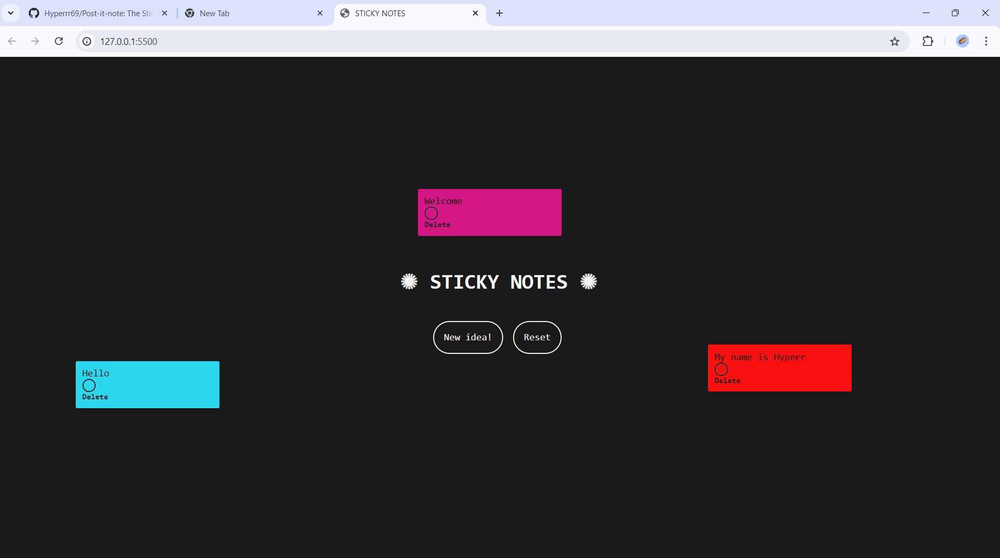

  
  

          
<h3>✺ Sticky Note Website ✺</h3>

The Sticky Note Website is a web page using HTML, CSS, and JavaScript. It provides a digital version of sticky notes, allowing users to create and organize virtual notes for various purposes.

* <b>Create Sticky Notes:</b> Users can create new sticky notes by simply clicking on a "New Note" button. Each note can contain text, allowing users to jot down reminders, ideas, or any other information.
* <b>Color Picker:</b> Users can change the color background of any note, just clicking on the color picker below the notes.
* <b>Drag and Drop:</b> The sticky notes are draggable, allowing users to rearrange them on the virtual canvas. This feature enables flexible organization and customization.
* <b>Edit and Delete:</b> Users can easily edit the content of a sticky note by clicking on it. Additionally, a delete option is available to remove unwanted notes from the canvas.
